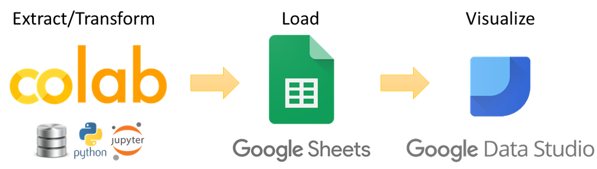

## **A compilation of free, practical tools to turn raw data into visual insights**

*Most of the world will make decisions by either guessing or using their gut. They will be either lucky or wrong* — Mixpanel founder Suhail Doshi

*If you can't measure it, you can't improve it* — renowned management thinker Peter Drucker

## Turn Data into Insights

There are lots of reasons why the data your startup is collecting is important: managing your team, impressing investors, delighting customers, planning for the future, etc. But which data? Where do you get it? How do you turn it from raw information into coherent story? And how can you do that on a tight budget? To answer those questions, we have developed this toolkit for startup founders who want to supplement their gut and intuition with data-driven insights.

## Practical Tools

To that end, [TheVentureCity](https://theventure.city/) has released a series of Jupyter notebooks, each illustrating a specific type of analysis in the list below. By combining working Python code with a discussion of how it works and why it is important, we designed these notebooks to be practical tools that you can use right away or adapt for your business. In this way, you can learn on your own by analyzing of your startup's data. 

Even if you do not have a dedicated data analyst at this time—and most of early-stage teams of 5-10 members do not have that role—make sure there is somebody on your engineering team who is tasked with instrumentation and analysis. It is this person who most needs to read this post. The Python code is fully commented and ready to run as-is in [Google Colaboratory](https://colab.research.google.com/notebooks/welcome.ipynb)'s cloud Jupyter notebook environment. (See below for more notes.)

As this post is the introduction and table of contents for the toolkit, be sure to bookmark this page. We intend to continue building it out in the coming weeks and months.

## Analysis Menu

Follow the links below to access the Jupyter notebook for that topic. Feel free to jump around as you see fit, though Items 0 (Introduction to Notebooks) and 1 (Data Building Blocks) should not be missed.

**0. Introduction to Notebooks**

* [Google Colaboratory Basics](https://colab.research.google.com/notebooks/welcome.ipynb)
* [Jupyter Notebook Quickstart](https://jupyter.readthedocs.io/en/latest/content-quickstart.html)

**1. Data Building Blocks** — START HERE! Before you can start analyzing the data, you need to understand raw event log data and how to access it. Then the raw data needs some pre-processing to convert it into a “DAU Decorated” data set, which serves as the jumping-off point for the rest of the analysis. 

* Part 1: Understanding Event Logs
* Part 2: Create the “DAU Decorated” data set

**2. Engagement** metrics gauge the extent to which users find value in the product by measuring the frequency with which they use it. In this way, we can use data to assess and track product-market fit, an important but tricky concept for which data. Solid engagement sets the stage for retention over a long period of time.

* Part 1: DAU Histogram and DAU/MAU Ratio 
* Part 2: DAU Histogram and DAU/MAU Ratio Trends over Time
* Further reading: Our post on [Going Beyond DAU/MAU Metrics for Growth](https://medium.com/theventurecity/going-beyond-dau-mau-metrics-for-growth-169b9eac7aec)

**3. Retention** metrics measure how long users continue to use the product after the first time they use it. Good retention makes growth so much easier and efficient: newly-acquired users count toward user growth rather than merely replacing lost users. 

* Part 1: Cohort User Retention
* Part 2: Month-over-Month and Week-over-Week Retention

**4. Growth Accounting** combines user or revenue growth with retention to arrive at a measure for growth efficiency called the Quick Ratio. Be sure to check out our post introducing this concept, [Quick Ratio as a Shortcut to Understand Product Growth](https://medium.com/theventurecity/quick-ratio-as-a-shortcut-to-understand-product-growth-ae60212bd371). 

* Part 1: User Quick Ratios
* Part 2: Revenue Quick Ratios
* Part 3: Rolling Quick Ratios
* Part 4: Segmented Quick Ratios
* Further reading: Our post on [Rolling Quick Ratios for Product Decision-Making](https://medium.com/theventurecity/rolling-quick-ratios-for-product-decision-making-ec758166a10f)

**5. Cohort Analysis** helps to measure not only user retention, but also customer long-term value (CLTV).

* Part 1: Cumulative Cohort CLTV
* Part 2: Cumulative Cohort CLTV Trends
* Part 3: Segmented Cohort Analysis

**6. Visual Dashboards** help make a store and point 

* Part 1: Integrating Python with Google Sheets
* Part 2: Google Data Studio visualizations from Google Sheets

## Credits

* This toolkit builds upon the fantastic [work](https://medium.com/swlh/diligence-at-social-capital-part-1-accounting-for-user-growth-4a8a449fddfc) done by Jonathan Hsu and his team at Social Capital
* Thanks to [Analytics Vidya](https://www.digitalvidya.com/blog/reasons-data-analytics-important/) for the meme.

## Notes

With the Google Colaboratory option there is no need to install any software. The other option is to install [Jupyter](https://jupyter.org/) (Python 3.6) and the relevant libraries on your local machine. Whatever your comfort level with Python, we encourage you learn by doing: hit Shift-Enter to run each cell and see what happens. If you want some exposure to some Python basics to supplement this toolkit, we recommend [DataCamp](https://www.datacamp.com/), which has some excellent free courses, including a [tutorial on Jupyter notebooks](https://www.datacamp.com/community/tutorials/tutorial-jupyter-notebook). Where possible, we are including sample Excel spreadsheets; however, most of the time, Python is the superior tool because it can handle larger data sets more easily and perform loops.